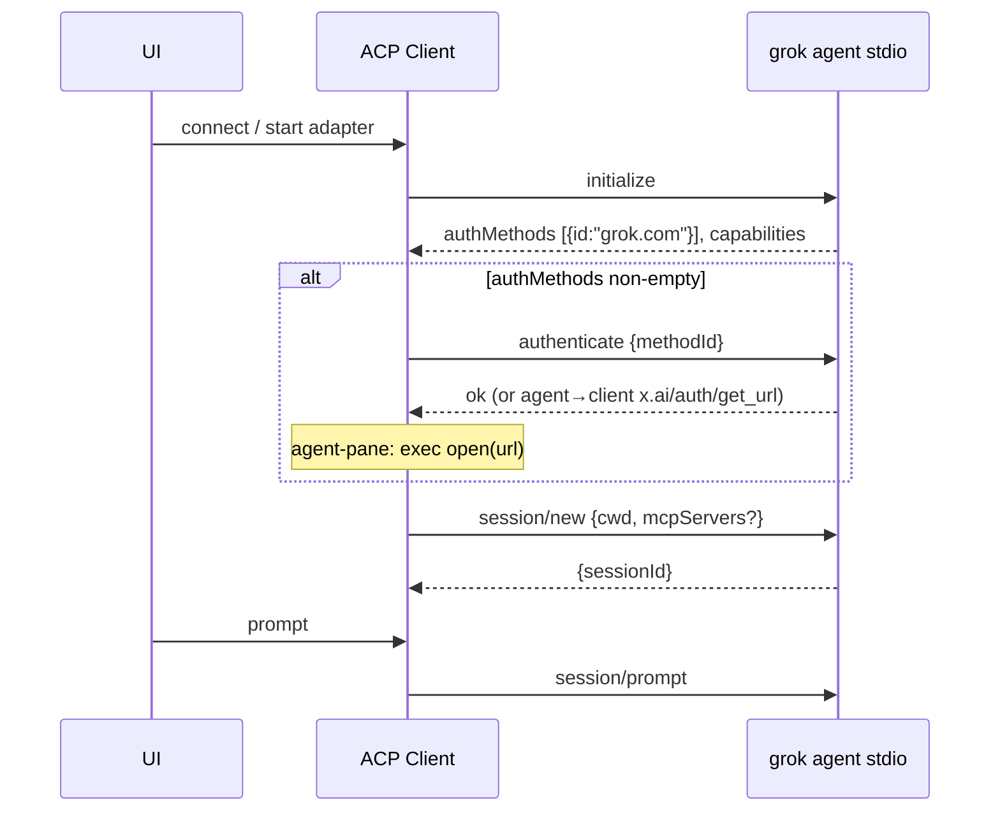
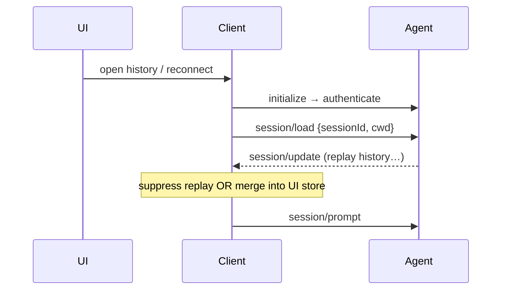
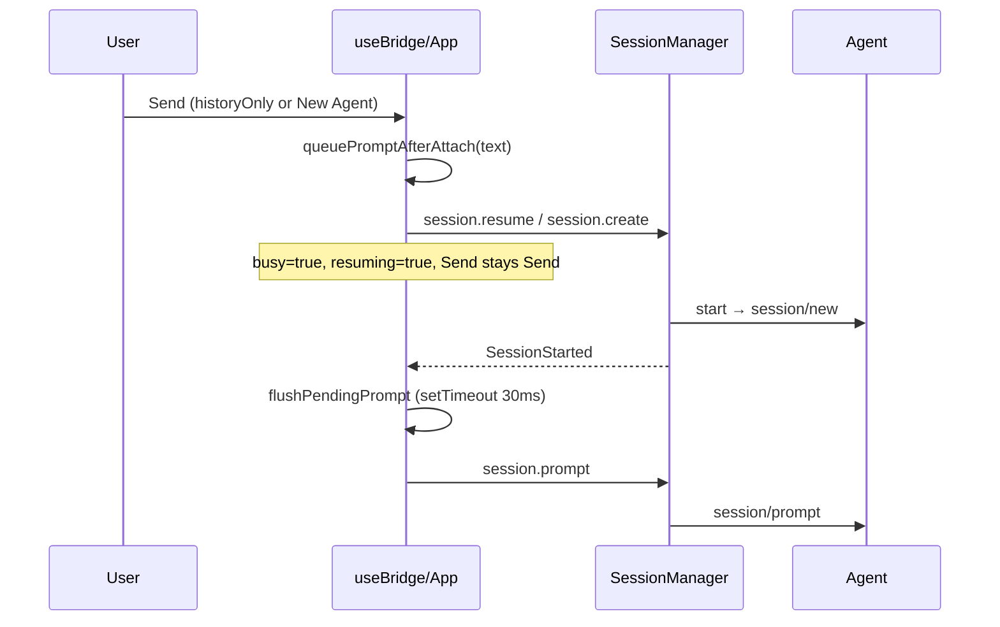

# ACP Resume / Auth / Queue Patterns (Research)

Sources: `@agentclientprotocol/sdk` (openclaw install), `acpx`, `~/.grok/docs`, Zed `agent_servers/src/acp.rs`, Cursor ACP docs, agent-pane bridge/web.

---

## 1) Authenticate before `session/new`

### References

| Project | Files / docs |
|---------|----------------|
| ACP spec | `sdk/schema/schema.json` — `initialize.authMethods`, `authenticate.methodId` |
| acpx | `dist/prompt-turn-CXMtXBl-.js` — `authenticateIfRequired`, `selectAuthMethod` |
| Grok | `user-guide/02-authentication.md`, `15-agent-mode.md` — `x.ai/auth/*` extensions |
| Cursor | [cursor.com/docs/cli/acp](https://cursor.com/docs/cli/acp) — `methodId: "cursor_login"` |
| Zed | `zed-industries/zed` `crates/agent_servers/src/acp.rs` — `authenticate()` |
| agent-pane | `apps/bridge/src/grok-acp-adapter.ts` L850–884, L340–367 |

### Sequence



### Auth details

- **methodId**: from `initialize._meta.defaultAuthMethodId` or first `authMethods[].id`. Grok returns `grok.com` with `defaultAuthMethodId: null`.
- **Browser login**: Grok may call client `x.ai/auth/get_url` (also `_x.ai/…`); client opens URL. Device code via `x.ai/auth/submit_code`. TUI equivalent: `grok login` → `auth.x.ai`.
- **acpx**: skips `authenticate` if no env/config credential unless `authPolicy: "fail"` — assumes agent self-auth (e.g. cached `~/.grok/auth.json`).
- **agent-pane (fixed)**: same as acpx skip — do **not** call `authenticate` up front; only after `session/new` returns auth_required. Up-front `authenticate({grok.com})` forced a 90s browser OAuth hang.
- **Cursor**: pre-auth via `agent login` / API key; ACP still sends `authenticate {cursor_login}`.
- **Zed**: exposes `auth_methods` to UI; user picks method before sessions.

### Busy / Send vs Stop

Not applicable at auth time in most UIs. agent-pane shows `AgentActivity` "Authenticating…" but does **not** set `busy` until a prompt is queued.

### Pros / cons (agent-pane)

**Pros:** matches Grok contract; handles `x.ai/auth/*` RPCs; reuses `~/.grok/auth.json`. **Cons:** `open` is macOS-only (Tauri should own); 90s auth blocks resume; no terminal-auth for headless SSO.

---

## 2) Resume / continue past chat

### References

| Project | Strategy | Files |
|---------|----------|-------|
| ACP spec | `session/load` replays via `session/update`; `session/resume` (unstable) no replay | `schema.json`, [session-resume RFD](https://agentclientprotocol.com/rfds/session-resume) |
| Grok docs | TUI `/resume`; CLI `-r` / `-c`; ACP `session/load` | `user-guide/17-sessions.md` L218–227 |
| acpx | `session/load` + drain replay → fallback `session/new` | `prompt-turn-CXMtXBl-.js` `connectAndLoadSession` |
| Zed | Capability-gated `load_session` / `resume_session`; UI already has thread history | `acp.rs` L596–750 |
| Cursor ACP | `session/load` when resuming | cursor.com/docs/cli/acp |
| agent-pane | **`session/new` + event-log digest** (avoids `session/load`) | `grok-acp-adapter.ts` L886–940; `session-manager.ts` `buildHistoryDigest`, `resumeSession` |

### Sequence — acpx / Zed (`session/load`)



### Sequence — agent-pane (digest, no load)

```mermaid
sequenceDiagram
  participant UI
  participant Bridge as SessionManager
  participant Adapter as GrokAcpAdapter
  participant Agent

  UI->>Bridge: session.resume / prompt (dead agent)
  Bridge->>Adapter: start(resumed:true, domainSessionId)
  Adapter->>Agent: initialize → authenticate → session/new
  Note over Adapter: skip browser MCP on resume; absorbUpdates unused
  Bridge->>Adapter: setContextPrefix(buildHistoryDigest)
  Bridge-->>UI: SessionStarted {resumed:true}
  UI->>Bridge: session.prompt (or flush pending)
  Adapter->>Agent: session/prompt (prefix + user text)
```

### Avoid UI stuck busy / Send→Stop while resuming

| Project | Approach |
|---------|----------|
| Zed | Thread UI separate from connection setup; load is async task |
| acpx | CLI blocks; `suppressReplayUpdates` + 5s replay drain timeout |
| agent-pane | `resuming` flag; `showStop = busy && !resuming && !historyOnly` (`App.tsx` L1167). `historyOnly` after idle exit. Replay from disk only in `openHistorySession` (no agent). Register `live` map **before** `SessionStarted` to avoid prompt race (`session-manager.ts` L312–313, L469). |

### Grok `loadSession` / hang risk

- Grok **advertises** `loadSession` (`agentCapabilities.loadSession`).
- agent-pane **observed**: `session/load` can succeed but next `session/prompt` never returns (~60s timeout) — comment at `grok-acp-adapter.ts` L886–891.
- **Digest trade-off**: reliable continue, but model context is lossy (12 turns, clipped text) vs full Grok `updates.jsonl`.
- **MCP on resume**: skipped to avoid Playwright handshake hang (`grok-acp-adapter.ts` L895–899).
- acpx mitigates load replay with `suppressReplayUpdates`, `waitForSessionUpdateDrain` (80ms idle, 5s max) — still uses load when capable.

### Pros / cons (agent-pane)

**Pros:** digest avoids prompt hang; domain jsonl is UI truth; offline history open. **Cons:** new `providerSessionId` each resume; lossy digest; re-auth latency; wastes Grok rewind/compact until load+prompt fixed.

---

## 3) Queue user message while reconnecting

### References

| Project | Mechanism | Files |
|---------|-----------|-------|
| acpx | Per-session **queue owner** (Unix socket `~/.acpx/queues/`); default wait, `--no-wait` enqueue | `README.md`, `session-BtwAKtJ3.js` `sendSession`, `ipc-BM335WFg.js` |
| Grok | `x.ai/queue/changed` notification | `grok-acp-adapter.ts` L550–568 |
| agent-pane UI | `pendingPromptRef` + `queuePromptAfterAttach` | `useBridge.ts` L159–162, L743–753 |
| agent-pane bridge | `prompt()` auto-`resumeSession` if dead; retry once | `session-manager.ts` L518–537, L628–653 |

### Sequence — agent-pane



### Avoid stuck busy

- Flush on **`SessionStarted` handler**, not `useEffect` (cleanup swallowed pending send — `useBridge.ts` L155–157).
- On bridge `error` before `SessionStarted`: restore draft from `pendingPromptRef` (L707–712).
- 100s resume watchdog clears `resuming`, restores draft (`useBridge.ts` L806–823).
- `createSession`: `busy` only if pending prompt exists (L774–776).

### acpx queue (contrast)

- Running prompt process owns queue; new prompts IPC to owner or spawn owner.
- Survives agent subprocess death by respawn + `session/load` fallback.
- agent-pane has **no cross-process queue** — single WebSocket + in-memory `pendingPromptRef`.

### Pros / cons (agent-pane)

**Pros:** simple `pendingPromptRef`; `resuming` separates attach vs turn; `skipUserEvent` on retry. **Cons:** single-slot queue; bridge auto-resume timing; no fire-and-forget.

---

## agent-pane snapshot (current)

```
initialize → authenticate(methodId) → session/new [never session/load on resume]
         ↓
resumeSession: buildHistoryDigest → setContextPrefix → live map → SessionStarted
         ↓
UI: history replay local; agent attach lazy on Send
         ↓
prompt: auto-resume if !isAlive; digest prepended once; absorbUpdates off
```

**Key files**: `grok-acp-adapter.ts`, `session-manager.ts`, `useBridge.ts`, `App.tsx` (send routing L880–902, `showStop` L1167).

---

## Recommendations

1. Keep pre-`session/new` `authenticate`; move URL open to Tauri.
2. Re-test `session/load` when Grok fixes prompt hang; probe `loadSession` capability at runtime.
3. Single-slot queue is enough for IDE UX; acpx queue only for CLI fan-in.

*2026-07-11 — research only.*
